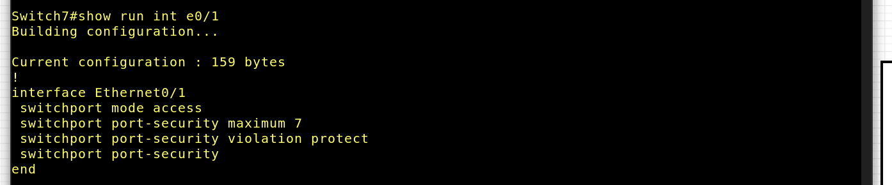

## Этапы выполнения работы

### Этап 1. Анализ инцидентов (24.03.2025 – 07.04.2025)

#### Максина Надежда Дмитриевна — ShrinkLocker

- Изучен инцидент, связанный с вредоносной активностью **ShrinkLocker**.  
- Установлено, что в качестве вектора атаки использовались сценарии Windows Script Files (WSF), что позволило злоумышленнику обойти традиционные механизмы защиты и инициировать цепочку шифрования.  
- Зафиксированы действия вредоносной программы:
  - шифрование содержимого всех доступных дисков;  
  - использование встроенного инструмента BitLocker без уведомления пользователя;  
  - генерация уникальных ключей шифрования с последующим их удалением.
- Проанализированы стадии атаки: начальная доставка, выполнение скрипта, активация BitLocker и уничтожение ключей.  
- Сделаны выводы о необходимости обеспечения многоуровневой защиты рабочих станций и наличии регулярного резервного копирования.

#### Ильина Александра Алексеевна — Troll Stealer

- Изучен инцидент, связанный с серией кибератак северокорейской хакерской группы Kimsuky с использованием **Troll Stealer**.  
- Установлено, что был использован дроппер, маскирующийся под установочный файл легитимного ПО южнокорейской компании SGA Solutions, подписанный украденным сертификатом компании D2Innovation Co., Ltd.  
- Зафиксированы действия вредоносной программы:
  - кража SSH-ключей и данных FileZilla;  
  - сбор файлов и каталогов с диска C;  
  - извлечение данных из браузеров;  
  - сбор системной информации;  
  - снятие скриншотов;  
  - кража сертификатов GPKI, используемых южнокорейскими государственными служащими.  
- Дополнительно задействован бэкдор **GoBear**, написанный на языке Go.  
- В процессе анализа действия злоумышленников сопоставлены с тактиками и техниками ATT&CK.

#### Товпеко Нина Игоревна — Операция «Форумный тролль»

- Изучен инцидент целевой атаки **Операция «Форумный тролль»**, направленной на сотрудников СМИ, госорганизаций и образовательных учреждений России.  
- Определено, что целью атаки было распространение персонализированных фишинговых писем с приглашением на форум «Примаковские чтения».  
- Зафиксированы действия злоумышленников:
  - фишинг с персонализированными письмами;  
  - эксплуатация уязвимости нулевого дня (CVE-2025-2783) в Google Chrome;  
  - автоматическое выполнение вредоносного кода при открытии страницы (Drive-by Download);  
  - сбор данных через скриншоты, кейлоггинг и доступ к локальным файлам;  
  - скрытые каналы связи для управления (HTTPS, DGA).  
- Сделаны выводы о необходимости мониторинга фишинговых кампаний, своевременного обновления браузеров и анализа сетевого трафика.

---

### Этап 2. Разработка сайта (08.04.2025 – 21.04.2025)

08.04 – инициализирован проект на базе генератора Hugo Extended, сформирована базовая структура сайта.  
09.04 – выбрана и подключена тема Hugo, выполнена настройка конфигурационного файла.  
10.04 – 11.04 – созданы основные разделы сайта: главная, "О проекте", "Участники", "Журнал", "Ресурсы".  
12.04 – 14.04 – подготовлены текстовые материалы, собрана информация о проекте и этапах разработки.  
15.04 – 16.04 – проведены консультации с куратором по наполнению сайта и корректности представленных данных.  
17.04 – 18.04 – добавлены изображения и визуальные элементы, оформлены стили, улучшен внешний вид страниц.  
19.04 – 20.04 – выполнено тестирование адаптивности и удобства навигации, внесены правки по мелким багам.  
21.04 – сайт собран и опубликован через GitHub Pages по адресу:  
[https://maksinand.github.io/TestingProject_Practice/](https://maksinand.github.io/TestingProject_Practice/)

---

### Этап 3. Выполнение вариативного задания (с 24.03.2025)

#### Базовая настройка сети Game Dev студии в PNETLab 

##### 1. Сетевая архитектура


| Сегмент        | VLAN | Подсеть           | Доступные IP    | Назначение                    |
| -------------- | ---- | ----------------- | --------------- | ----------------------------- |
| Программисты   | 2    | `10.0.0.128/25`   | `.129` – `.254` | Рабочие станции               |
| Администраторы | 6    | `10.0.0.0/28`     | `.1` – `.14`    | Доступ к управлению           |
| Серверы        | 3    | `10.0.2.0/24`     | `.1` – `.254`   | DNS, DHCP, GIT, Syslog и т.д. |
| Интернет / WAN | —    | `192.168.10.0/24` | `.1` – `.254`   | Подключение к внешней сети    |

##### 2. Конфигурация оборудования

- Подробнее про работу с оборудованием и конфигурацию оборудования в PNETLab можно посмотреть в вынесенном отдельно модуле **Базовая конфигурация**
- Также в приложение вынесены модули Атака-Защита сетевой инфраструктуры (упрощенного варианта вышеописанной сети), где более подробно разобраны:
	- **CAM-table overflow**
	- **ARP-Spoofing**
	- **VLAN Hopping**
	- **MAC-Spoofing**
 
###### Switch7 (основной для доступа)

- Базовая настройка:
```
enable
conf t
hostname Switch7
no ip domain-lookup
enable secret strongpass
service password-encryption
banner motd ^WARNING: Unauthorized access is prohibited!^
```
- VLAN и trunk:
```
vtp domain gamedev
vtp mode transparent

vlan 2
 name Programmers
vlan 3
 name Servers
vlan 6
 name Admins

interface range e0/1, e0/2
 switchport mode trunk
```
- Настройка порта для Win10 (VLAN 2 + Port-Security):
```
interface e1/2
 description Подключение Win10 (VLAN 2 - Programmers)
 switchport mode access
 switchport access vlan 2
 switchport port-security
 switchport port-security maximum 1          ! Только 1 MAC-адрес разрешён
 switchport port-security mac-address sticky ! Автоматически запоминает MAC
 switchport port-security violation restrict ! Нарушения логгируются, но порт не отключается
```

###### Switch8 (серверный)
```
hostname Switch8
vtp mode transparent
vtp domain gamedev

vlan 3
 name Servers

interface e1/0
 switchport mode access
 switchport access vlan 3

interface e1/1
 switchport mode access
 switchport access vlan 3

interface e1/2
 switchport mode access
 switchport access vlan 3

logging host 10.0.2.10
```
###### Switch9 (дистрибутивный)
```
hostname Switch9
vtp mode transparent
vtp domain gamedev

interface e0/0
 switchport mode trunk

interface e0/1
 switchport mode trunk

interface e0/2
 switchport mode access
 switchport access vlan 6
```
###### Switch (7-9)
```
logging buffered 4096 debugging             ! Логирование в буфер памяти
logging host 10.0.2.10                      ! Сетевой syslog-сервер
logging trap informational                  ! Уровень логгирования на удалённый сервер
service timestamps log datetime msec        ! Отметка времени с миллисекундами
```
###### Router (межвлан-маршрутизация и NAT)
- Интерфейсы
``` 
interface e0/0
 ip address 192.168.10.254 255.255.255.0
 no shutdown

interface e0/1.2
 encapsulation dot1Q 2
 ip address 10.0.0.1 255.255.255.128

interface e0/1.3
 encapsulation dot1Q 3
 ip address 10.0.2.254 255.255.255.0

interface e0/1.6
 encapsulation dot1Q 6
 ip address 10.0.0.14 255.255.255.240
```
- NAT и доступ в интернет:
```
ip nat inside source list 1 interface e0/0 overload

access-list 1 permit 10.0.0.0 0.0.255.255

interface e0/0
 ip nat outside
interface e0/1
 ip nat inside
```
Дополнительно 
- DHCP (если не на сервере):
```
ip dhcp pool PROGRAMMERS
 network 10.0.0.128 255.255.255.128
 default-router 10.0.0.1
 dns-server 10.0.2.10

ip dhcp pool ADMINS
 network 10.0.0.0 255.255.255.240
 default-router 10.0.0.14
 dns-server 10.0.2.10
```
###### pfSense (Firewall + WAN шлюз)

- WAN: e0 — подключение к интернету

- LAN: e1 — 192.168.10.1/24

- Базовые правила firewall:
	- Разрешить:
        - HTTP/HTTPS
		- DNS, SSH, ICMP
        - NAT к внешнему
    - Блокировать:
        - МежVLAN (кроме Admin → Server)
        - Входящие подключения к pfSense

- IDS / IPS:
	- Установить пакет через pfSense Package Manager
	-Настроить:
    	- LAN-интерфейс
    	- Правила: Emerging Threats, Snort GPL
    - Алерты:
        - Port Scan
		- Brute Force
        - Malware Activity
	- Включить blocking mode

- Логирование (настройка):
    - System > Logging -> Remote syslog
        - IP: 10.0.2.10
        - Facility: local0
        - Enable logging firewall events

##### 3. Серверы — развертывание служб
Настройка серверов (пример):

###### WinServer16 (10.0.2.10)  — SYSLOG + DNS + DHCP (если не на роутере)
**RSyslog приёмник**

- Установка NXLog:
```
Install-PackageProvider -Name NuGet -Force
Install-Module -Name nxlog-ce
```
Конфигурация (`nxlog.conf`):
```
<Input in>
  Module im_udp
  Host 0.0.0.0
  Port 514
</Input>

<Output out>
  Module om_file
  File "C:\\Logs\\switch_logs.log"
</Output>

<Route r>
  Path in => out
</Route>
```
**DNS Server**
- Зона: `gamedev.local`
- DNS-записи:
	- router.gamedev.local -> 10.0.0.1
	- git.gamedev.local -> 10.0.2.20
	- files.gamedev.local -> 10.0.2.30

###### WinServer22 (10.0.2.20) — GIT + Jenkins
- GitLab Runner (Docker или EXE)
- Jenkins с интеграцией в AD (если настроено)
- SSH ключи деплоя
- Логирование действий разработчиков

###### Linux-сервер (10.0.2.30) — Fail2Ban, rsyslog, rsync
- rsyslog (приём логов с Cisco/pfSense)
- Fail2Ban
- Git mirror / CI
- SFTP

##### 4. Security Policy Checklist 

###### A. Контроль доступа

| Группа         | VLAN | Доступ к                |
| -------------- | ---- | ----------------------- |
| Программисты   | 2    | Git, Jenkins, интернет  |
| Администраторы | 6    | Полный доступ           |
| Серверы        | 3    | Только по нужным портам |

**ACL на роутере:**
``` 
access-list 100 deny ip 10.0.0.128 0.0.0.127 10.0.2.0 0.0.0.255
access-list 100 permit ip any any

interface e0/1.2
 ip access-group 100 in
```
###### B. Аудит и логирование
- Все устройства логируют на 10.0.2.10
- Используется:
    - login on-success/failure
    - logging trap informational
	- pfSense -> syslog
- Анализ логов через ELK stack (опц.)

###### C. Резервное копирование
- WinServer16: резерв DNS, DHCP и SYSLOG каждую ночь на NAS
- Linux-сервер:
	- rsnapshot / rsync на внешний диск
	- Журнал rsyslog сохраняется ежедневно
- Cisco config: `copy running-config tftp` по расписанию через cron или вручную

###### D. Обновления
- Windows Server -> WSUS или вручную еженедельно
- Linux -> еженедельно вручную с ипользованием менеджера пакетов 
- Cisco -> регулярная проверка (минимум раз в месяц) и обновление образов
- pfSense -> ручное обновление через GUI

###### E. Пароли и аутентификация
- Сложные пароли >= 15 символов
- Ротация каждые 90 дней (опц.)
- Двухфакторная авторизация
- SSH доступ (если есть) — по ключам

###### F. IDS/IPS и защита от атак
- Suricata на pfSense
- Fail2Ban на Linux
- Ограничение по MAC-адресу на Switch7/8
- Блокировка неизвестных устройств через port-security

### Приложение

#### Базовая работа с виртуальной лабораторией PNETLab

##### Часть 1. Создание топологии

План топологии следующий:


##### Часть 2. Работа с сетевыми устройствами

> Взаимодействие с сетевыми устройствами Cisco IOL происходит с помощью CLI

###### Настройка коммутатора

2.1 Зайдём в Switch7 и перейдём в привилегированный режим.

`Switch>enable`


2.2 Просмотрим его таблицу коммутации.

`Switch#show mac address-table`


2.3 Настроим имя устройства. Перейдём в режим конфигурации.

`Switch#configure terminal`


2.4 Укажем имя устройства.

`Switch(config)#hostname Switch7`


2.5 Настроим ip адрес для управления Switch7.
```
Switch7(config)#interface vlan 1
Switch7(config-if)#ip address 192.168.1.100 255.255.255.0
Switch7(config-if)#no shutdown
```


2.6 Ставим пароль на консоль.
```
Switch7(config)#line console 0
Switch7(config-line)#password VeryStrongPasswd
Switch7(config-line)#login
```
> Надо понимать, что физическая безопасность устройства важный аспект защиты, так как, имея физический доступ к консольному порту, даже не зная пароля его можно сбросить. 

> Этот пароль и все пароли далее устанавливаются в демонстрационных целях. На практике нужно использовать более сильные варианты.


2.7 Ставим пароль на привилегированный режим.

`Switch7(config)#enable secret VeryStrongPasswd`


2.8 Пароль на консоль (и все остальные, которые могли быть поставлены с помощью `password`) хранятся в открытом виде, поэтому включаем службу шифрования паролей.

`Switch7(config)#service password-encryption`


2.9 Создадим учетную запись для пользователя и включим модель аутентификации.
```
Switch7(config)#username user password Qq123456
Switch7(config)#aaa new-model
```


2.10 Выйдем из режима конфигурации и сохраним конфиг.
```
Switch7(config)#exit
Switch7#write
```


###### Настройка маршрутизатора 

2.11 Зайдём в роутер. После нажатия Enter он спросит, желаете ли автонастройку. Отказываемся.


2.12 Повторяем пункты 2.6-2.8 для роутера

2.13 Настроим адрес внутреннего интерфейса е0/1. Это будет адрес шлюза по умолчанию для наших устройств.
```
Router(config)#int e0/1
Router(config-if)#ip address 192.168.1.1 255.255.255.0
Router(config-if)#no shutdown
```


2.14 Создаём ACL для будущего NAT. Это значит, что натить роутер будет только подсеть 192.168.1.0/24.
```
Router(config)# access-list 99 permit 192.168.1.0 0.0.0.255 
Router(config)# ip nat inside source list 99 interface e0/0 overload
Router(config)#int e0/0
Router(config-if)#ip nat outside
Router(config)#int e0/1
Router(config-if)#ip nat inside
```


##### Часть 3. Анализ трафика

Теперь с помощью Wireshark можем отследить, например, ARP трафик.


#### Переполнение таблицы коммутации

Генерируется большое количество адресов и коммутатор записывает их в свою таблицу, 
а реальные адреса реальных устройств постепенно выходят из нее. В таком случае коммутатор 
начнет рассылать кадры, адресованные конкретному получателю на все порты, 
находящиеся в той же VLAN, следовательно у атакующего устройства появится возможность 
перехватить и прочитать их.

Следует заметить, что все незащищённые коммутаторы, подключенные к атакованному 
также подхватят фальшивые MAC-адреса и начнут вести широковещательную рассылку всех 
кадров.

##### Часть 1. Демонстрация CAM-table overflow

1.1 Установим на Kali Linux необходимую утилиту `dsniff`. Начнём атаку и через несколько секунд остановим её с помощью ctrl+c
`macof -i eth0`


1.2 Увидим, что таблица коммутации Switch7 переполнена. При этом другие устройства будут испытывать проблемы с сетью.


1.3 В Wireshark видим большое количество IPv4 запросов.


##### Часть 2. Защита от CAM-table overflow

2.1 Настроим защиту от CAM-table overflow.


2.2 Просмотрим таблицу MAC-адресов после атаки =>  защитные меры работают.


#### ARP-Spoofing

Arp-Spoofing - это атака типа Man-In-The-Middle, осуществляется путем подмены значений в ARP таблице хостов, позволяя прослушивать сетевой трафик. 

Также необходимо настроить пересылку фреймов на конечный хост, чтобы сетевое подключение от источника к конечному хосту не терминировалось. Для проведения атаки arp-spoofing должны быть разрешены транзитные пакеты.

##### Часть 1. Демонстрация ARP-Spoofing

1.1 Разрешить IPv4 forwarding можно отредактировав файл `/etc/sysctl.conf`: 
нужно раскомментировать строку `net.ipv4.ip_forward=1`. 


После чего применим изменения командой `sysctl -p /etc/sysctl.conf`.


1.2 Осмотрмся в сети для поиска целевых ip: `nmap -sn 192.168.1.0/24`.


1.4 Начнём атаку с помощью опций для двусторонней подмены `arpspoof -i eth0 -t 192.168.1.50 -r 192.168.1.100`,

где

- 50 – адрес Win7,
- 100 – адрес Switch7,
- eth0 – сетевой интерфейс Kali22.

То же самое делаем для шлюза, иначе tcp трафик пойдет в обход Kali.
`arpspoof -i eth0 -t 192.168.1.50 -r 192.168.1.1`


ARP таблица на Win7:


1.5 Сделаем эхо запрос в Windows 7 к шлюзу и с помощью Wireshark увидим трафик в Kali Linux.


Зайдём на сайт в Windows 7 и также увидим трафик.


##### Часть 2. Защита от ARP-Spoofing

2.1 DHCP snooping — технология, базирующаяся на функционале IP-MAC-Port binding, которая позволяет предоставлять доступ к сети только авторизованным клиентам. Включаем (т.к. DAI использует DHCP Snooping Binding Table, даже если адреса статические):


2.2 Настраиваем ARP списки доступа для инспекции, т.к. используются статические адреса.


2.3 Включаем ARP инспекцию.


2.4 Устанавливаем доверенный интерфейс (где подключен роутер).  Все порты, к которому подключены конечные пользователи считаются недоверенными.


2.5 Теперь, из-за недоверенного для ARP-инспекции порта Kali и отсутствия его в списках доступа, атака неосуществима. 


Для Win7 всё по-прежнему работает.


#### VLAN Hopping

##### Часть 1. Демонстрация VLAN Hopping

1.1 Поместим Win10 в `vlan10`:


1.2 Сконфигурируем `trunk port` на Switch7


1.3 Настроим на Switch9 интерфейсы `е0/0`, `e0/1`, `e0/2` в `trunk`.


1.4 Настроим на роутере шлюз для `vlan10`.
```
Router(config)#int e0/1.10
Router(config-subif)#encapsulation dot1q 10
Router(config-subif)#ip address 192.168.10.1 255.255.255.0
```

После этих настроек Kali и Win10 будут доступны по сети, но трафик между ними будет проходить через маршрутизацию роутером. Используем атаку VLAN hopping, чтобы получить доступ в рамках широковещательного домена из Kali до Win10.

1.5 Установим `Yersinia`


1.6 Запустим `Yersinia`


1.7 Проведем атаку на протокол DTP


1.8 Подготовим интерфейсы Kali


1.9 С помощью Wireshark проанализируем исходящий трафик от Kali найдём трафик с `vlan id 10`.


##### Часть 2. Защита от VLAN Hopping

2.1 Из этого состояния порт может перейти в trunk, DTP-кадры при этом не передаются


#### MAC-Spoofing

Суть данной атаки заключается в подмене MAC-адреса на сетевой карте компьютера, что позволяет ему перехватывать пакеты, адресованные другому устройству, находящемуся в том же широковещательном домене.

В таблице MAC-адресов коммутатора запись с атакованным MAC-адресом будет соотнесена с интерфейсом, на котором в последний раз был идентифицирован кадр с данным source MAC. Таким образом, до поступления кадра с атакуемого устройства, все данные коммутатор, на основании своей CAM-таблицы, будет пересылать на атакующий компьютер.

##### Часть 1. Демонстрация MAC-Spoofing

1.1 Поменяем MAC-адрес Kali на тот, что присвоен Win7. Теперь у них одинаковые адреса, а значит трафик должен идти на Kali, так как MAC-адрес не привязан к интерфейсу. Просмотрим таблицу коммутации и убедимся в этом:


1.2 Для полноты картины предварительно откатим настройки `port-security` (из-зи предыдущих настроек `violation` интерфейс Kali попал в `error-disabled`). На свитче после этого мы можем увидеть, что интерфейс для этого MAC-адреса был изменен.


1.3 Допустим, что пользователь выключил Win7. Теперь она никаким образом (например, если она включена и мы пропингуем её со Switch7, то атака сорвется) не сможет участвовать в сети.Отправим эхо запрос с Kali на шлюз и увидим, что он действительно "от лица" Win7 (её MAC-адреса).


1.4 Включим Win7. Теперь при попытке пинга ошибка, т.е. она вытеснена из сети.


##### Часть 2. Защита от MAC-Spoofing
 
2.1 Настроим защиту от MAC-spoofing, привязав MAC-адрес к интерфейсу и настроив режимы реагирования на `e0/1` и `e1/1`.


2.2 Теперь при попытках атак видим, что защита полностью сработала и функционирует.


