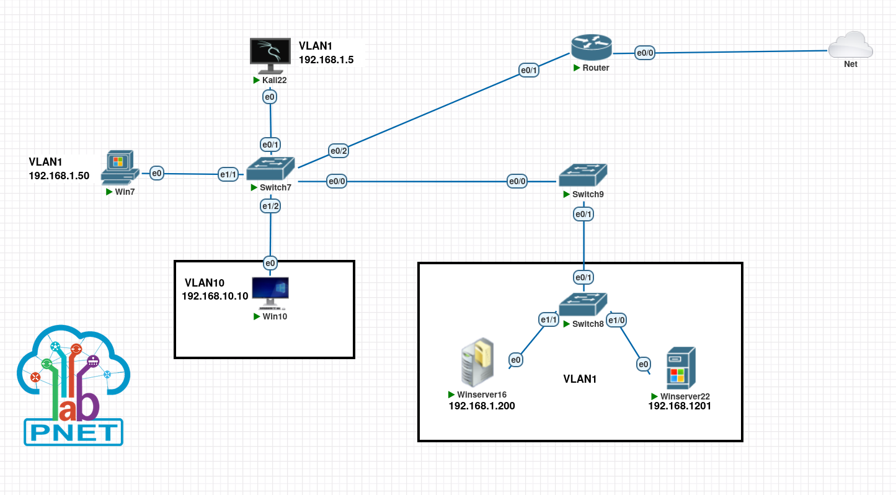
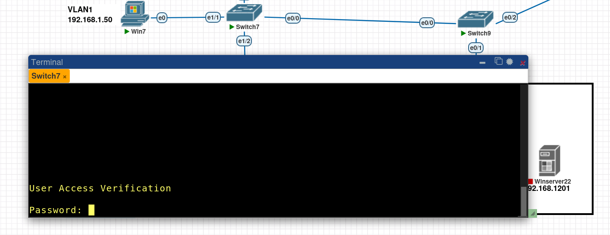

## Этапы выполнения работы

### Этап 1. Анализ инцидентов (24.03.2025 – 07.04.2025)

#### Максина Надежда Дмитриевна — ShrinkLocker

- Изучен инцидент, связанный с вредоносной активностью **ShrinkLocker**.  
- Установлено, что в качестве вектора атаки использовались сценарии Windows Script Files (WSF), что позволило злоумышленнику обойти традиционные механизмы защиты и инициировать цепочку шифрования.  
- Зафиксированы действия вредоносной программы:
  - шифрование содержимого всех доступных дисков;  
  - использование встроенного инструмента BitLocker без уведомления пользователя;  
  - генерация уникальных ключей шифрования с последующим их удалением.
- Проанализированы стадии атаки: начальная доставка, выполнение скрипта, активация BitLocker и уничтожение ключей.  
- Сделаны выводы о необходимости обеспечения многоуровневой защиты рабочих станций и наличии регулярного резервного копирования.

#### Ильина Александра Алексеевна — Troll Stealer

- Изучен инцидент, связанный с серией кибератак северокорейской хакерской группы Kimsuky с использованием **Troll Stealer**.  
- Установлено, что был использован дроппер, маскирующийся под установочный файл легитимного ПО южнокорейской компании SGA Solutions, подписанный украденным сертификатом компании D2Innovation Co., Ltd.  
- Зафиксированы действия вредоносной программы:
  - кража SSH-ключей и данных FileZilla;  
  - сбор файлов и каталогов с диска C;  
  - извлечение данных из браузеров;  
  - сбор системной информации;  
  - снятие скриншотов;  
  - кража сертификатов GPKI, используемых южнокорейскими государственными служащими.  
- Дополнительно задействован бэкдор **GoBear**, написанный на языке Go.  
- В процессе анализа действия злоумышленников сопоставлены с тактиками и техниками ATT&CK.

#### Товпеко Нина Игоревна — Операция «Форумный тролль»

- Изучен инцидент целевой атаки **Операция «Форумный тролль»**, направленной на сотрудников СМИ, госорганизаций и образовательных учреждений России.  
- Определено, что целью атаки было распространение персонализированных фишинговых писем с приглашением на форум «Примаковские чтения».  
- Зафиксированы действия злоумышленников:
  - фишинг с персонализированными письмами;  
  - эксплуатация уязвимости нулевого дня (CVE-2025-2783) в Google Chrome;  
  - автоматическое выполнение вредоносного кода при открытии страницы (Drive-by Download);  
  - сбор данных через скриншоты, кейлоггинг и доступ к локальным файлам;  
  - скрытые каналы связи для управления (HTTPS, DGA).  
- Сделаны выводы о необходимости мониторинга фишинговых кампаний, своевременного обновления браузеров и анализа сетевого трафика.

---

### Этап 2. Разработка сайта (08.04.2025 – 21.04.2025)

08.04 – инициализирован проект на базе генератора Hugo Extended, сформирована базовая структура сайта.  
09.04 – выбрана и подключена тема Hugo, выполнена настройка конфигурационного файла.  
10.04 – 11.04 – созданы основные разделы сайта: главная, "О проекте", "Участники", "Журнал", "Ресурсы".  
12.04 – 14.04 – подготовлены текстовые материалы, собрана информация о проекте и этапах разработки.  
15.04 – 16.04 – проведены консультации с куратором по наполнению сайта и корректности представленных данных.  
17.04 – 18.04 – добавлены изображения и визуальные элементы, оформлены стили, улучшен внешний вид страниц.  
19.04 – 20.04 – выполнено тестирование адаптивности и удобства навигации, внесены правки по мелким багам.  
21.04 – сайт собран и опубликован через GitHub Pages по адресу:  
[https://maksinand.github.io/TestingProject_Practice/](https://maksinand.github.io/TestingProject_Practice/)

---

### Этап 3. Выполнение вариативного задания (с 24.03.2025)


#### Базовая работа с виртуальной лабораторией PNETLab

##### Часть 1. Создание топологии

План топологии следующий:


##### Часть 2. Работа с сетевыми устройствами

> Взаимодействие с сетевыми устройствами Cisco IOL происходит с помощью CLI

###### Настройка коммутатора

2.1 Зайдём в Switch7 и перейдём в привилегированный режим.

`Switch>enable`


2.2 Просмотрим его таблицу коммутации.

`Switch#show mac address-table`


2.3 Настроим имя устройства. Перейдём в режим конфигурации.

`Switch#configure terminal`


2.4 Укажем имя устройства.

`Switch(config)#hostname Switch7`


2.5 Настроим ip адрес для управления Switch7.
```
Switch7(config)#interface vlan 1
Switch7(config-if)#ip address 192.168.1.100 255.255.255.0
Switch7(config-if)#no shutdown
```


2.6 Ставим пароль на консоль.
```
Switch7(config)#line console 0
Switch7(config-line)#password VeryStrongPasswd
Switch7(config-line)#login
```
> Надо понимать, что физическая безопасность устройства важный аспект защиты, так как, имея физический доступ к консольному порту, даже не зная пароля его можно сбросить. 

> Этот пароль и все пароли далее устанавливаются в демонстрационных целях. На практике нужно использовать более сильные варианты.




2.7 Ставим пароль на привилегированный режим.

`Switch7(config)#enable secret VeryStrongPasswd`


2.8 Пароль на консоль (и все остальные, которые могли быть поставлены с помощью `password`) хранятся в открытом виде, поэтому включаем службу шифрования паролей.

`Switch7(config)#service password-encryption`


2.9 Создадим учетную запись для пользователя и включим модель аутентификации.
```
Switch7(config)#username user password Qq123456
Switch7(config)#aaa new-model
```


2.10 Выйдем из режима конфигурации и сохраним конфиг.
```
Switch7(config)#exit
Switch7#write
```


###### Настройка маршрутизатора 

2.11 Зайдём в роутер. После нажатия Enter он спросит, желаете ли автонастройку. Отказываемся.


2.12 Повторяем пункты 2.6-2.8 для роутера

2.13 Настроим адрес внутреннего интерфейса е0/1. Это будет адрес шлюза по умолчанию для наших устройств.
```
Router(config)#int e0/1
Router(config-if)#ip address 192.168.1.1 255.255.255.0
Router(config-if)#no shutdown
```


2.14 Создаём ACL для будущего NAT. Это значит, что натить роутер будет только подсеть 192.168.1.0/24.
```
Router(config)# access-list 99 permit 192.168.1.0 0.0.0.255 
Router(config)# ip nat inside source list 99 interface e0/0 overload
Router(config)#int e0/0
Router(config-if)#ip nat outside
Router(config)#int e0/1
Router(config-if)#ip nat inside
```


##### Часть 3. Анализ трафика

Теперь с помощью Wireshark можем отследить, например, ARP трафик.


