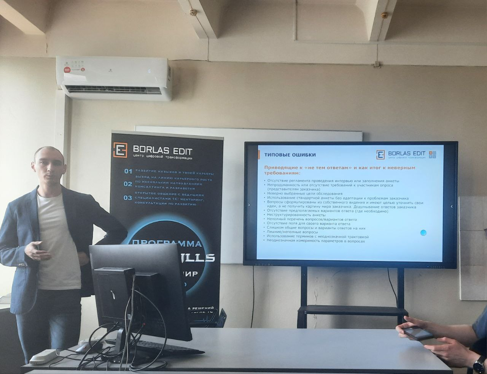
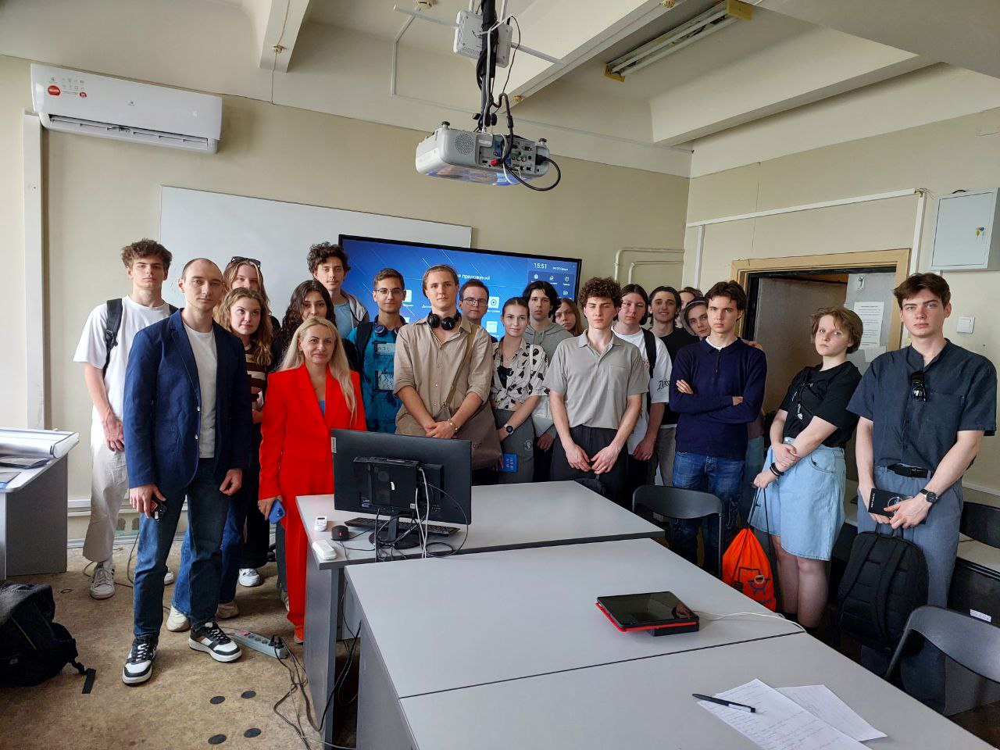
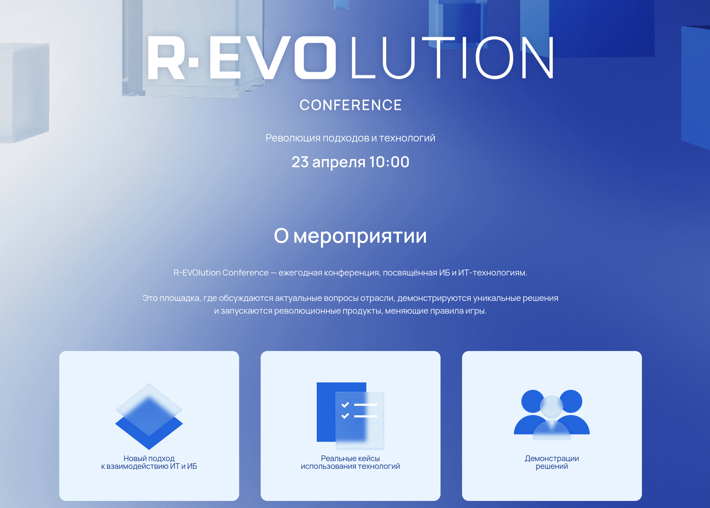
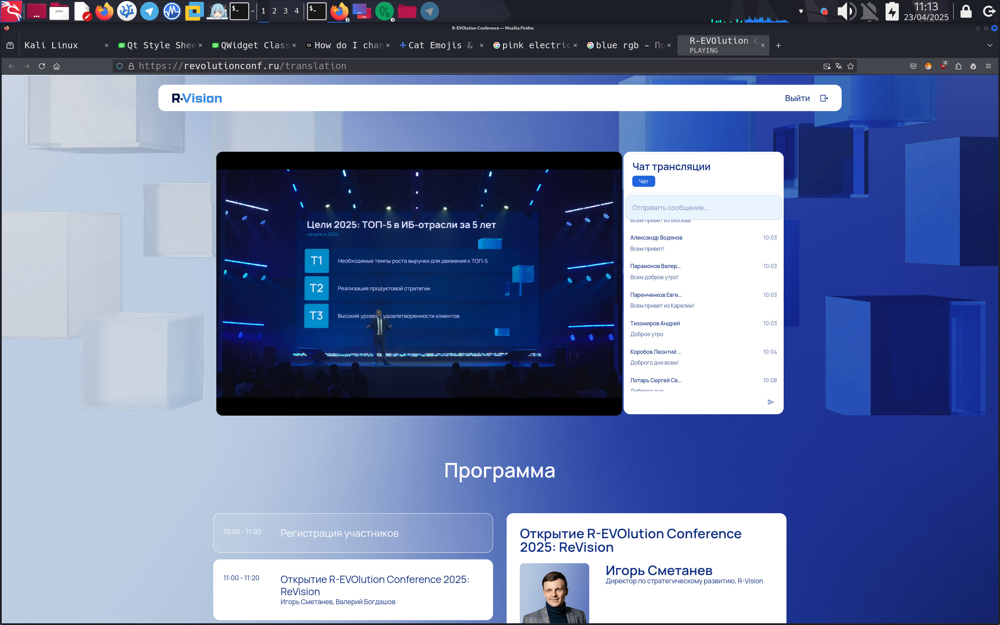

# Отчет о посещении мастер-класса «Требования и их важность при разработке ПО»

## Общая информация

23 апреля состоялся мастер-класс «Требования и их важность при разработке ПО», организованный компанией [**ООО "Эдит Про"**](https://www.borlas-edit.ru/about/).
Мероприятие было посвящено ключевым аспектам выявления и анализа требований заказчика в процессе разработки программного обеспечения. 
Участники погрузились в реальные сценарии разработки, что дало возможность не только получить теоретические знания, но и применить 
их на практике в ходе деловой игры.

## О компании ООО "Эдит Про"

ООО "Эдит Про" — компания, специализирующаяся на разработке программного обеспечения и консалтинге в области IT.
С момента своего основания компания стремится создавать решения, которые соответствуют потребностям клиентов и 
помогают им достигать бизнес-целей. Основные направления работы компании включают:

- Консалтинг в области разработки ПО — помощь в выявлении и формулировании требований.
- Обучение и развитие — проведение мастер-классов и тренингов для специалистов в области IT.
- Поддержка проектов — помощь в управлении проектами и внедрении новых решений.

### Цели компании
1. Увеличение качества разрабатываемого ПО через глубокое понимание потребностей заказчиков.
2. Развитие образовательных программ для повышения квалификации специалистов в области разработки ПО.
3. Сбор и анализ обратной связи от клиентов для улучшения предлагаемых услуг и продуктов.

## Программа мастер-класса

Мастер-класс включал несколько ключевых тем:

- **Выявление и анализ требований**: Участники узнали о методах активного слушания и задавания открытых вопросов, которые помогают лучше 
понять потребности заказчика.

- **Приоритизация требований**: Обсуждались методы расстановки приоритетов, позволяющие определить, какие требования являются 
наиболее критичными для успешной реализации проекта.

- **Практическое применение знаний**: В ходе деловой игры участники смогли применить полученные знания на практике, что способствовало 
лучшему усвоению материала.

## Заключение

Мастер-класс «Требования и их важность при разработке ПО» от компании ООО "Эдит Про" стал отличной возможностью для участников углубить свои знания в области разработки программного обеспечения и освоить практические навыки работы с требованиями заказчика. Полученные знания и опыт помогут создавать более качественные и полезные решения для клиентов.

---
# Отчет о посещении конференции R-EVOlution Conference 2025
## Общая информация

23 апреля состоялась конференция R-EVOlution Conference 2025, посвященная новым методам автоматизации и взаимодействию в области IT и кибербезопасности. На мероприятии были представлены реальные примеры внедрения решений, включая практический опыт использования системы SOAR (Security Orchestration, Automation and Response) в банковской сфере. Организатором конференции выступила компания [**R-Vision**](https://rvision.ru/).

## О компании R-Vision

R-Vision — это разработчик решений в области цифровизации и кибербезопасности, который с 2011 года создает технологии, помогающие организациям эффективно противостоять киберугрозам и обеспечивать надежность IT-инфраструктуры. Продукты компании используются в крупных банках, государственных учреждениях, а также в таких отраслях, как нефтегазовая, энергетическая и металлургическая.

## Цель компании:

Разработка передовых решений и сервисы, которые дают клиентам необходимый технологический уровень, чтобы уверенно противостоять угрозам и действовать быстрее, чем киберпреступники

## Доклады и обсуждения

- **Chief-прожарка: ИБ vs ИТ**\
	Острая дискуссия о том, как ИТ и ИБ-команды справляются с вызовами в условиях ограниченных ресурсов и сложных задач.
	Участники обсудили проблемы финансирования, своевременного реагирования и закрытости платформ. Особое 
	внимание было уделено поиску баланса между ИТ и ИБ и решению конфликта интересов внутри компании.

- **Выступление Дарьи Петровой: Революция подходов и технологий**\
	Дарья Петрова представила платформу R-Vision EVO, которая объединяет IT и информационную безопасность в единую экосистему, предлагая высокую производительность, унифицированные интерфейсы и гибкость интеграции. Основные продукты на базе EVO включают системы управления конфигурациями, управления жизненным циклом IT-активов и платформу управления данными.

- **Доклад Виктора Никуличева: Data or Die**\
	Виктор Никуличев обсудил, как современные методы работы с данными могут быть применены для улучшения управления корпоративными данными. Он подчеркнул важность качества данных и предложил платформенный подход для решения проблем, связанных с данными.

- **Выступление Сафрона Дандаева: Внедрение SOAR в банковском секторе**\
	Сафрон Дандаев поделился опытом внедрения системы SOAR, акцентировав внимание на необходимости автоматизации рутинных процессов для повышения эффективности работы аналитиков. Он привел примеры автоматизации проверки подозрительных писем и учета съемных носителей информации.

- **Доклад Марата Шамсутдинова: Внедрение и эксплуатация SOAR**\
	Марат Шамсутдинов рассказал о подходах к внедрению SOAR, акцентируя внимание на важности поэтапного развития системы. Он отметил, что внедрение SOAR позволяет значительно улучшить процессы управления инцидентами, делая их более прозрачными и эффективными.

## Заключение

Конференция R-EVOlution Conference 2025 предоставила уникальную возможность ознакомиться с новейшими подходами в области кибербезопасности и автоматизации. Полученные знания будут полезны для дальнейшего развития систем информационной безопасности и повышения их эффективности.

---